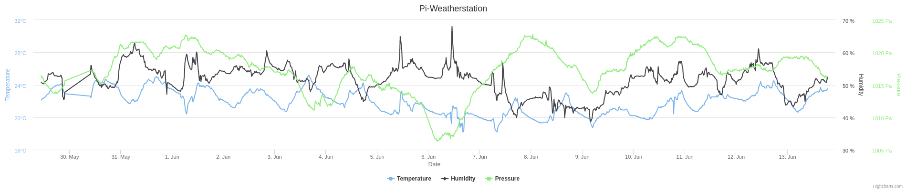

pi-weatherstation
=================

What hardware do I need?
-------------------------
| Hardware parts | Recommendation  | Alternatives |
| ---------------- | :----------------: |:----------------:|
| System: |   Raspberry Pi Zero W    | Raspberry Pi Model A/A+/B/B+ |
| Wlan stick: | [EDIMAX EW-7811](http://www.amazon.com/EW-7811UN-IEEE-802-11n-draft-USB/dp/B003MTTJOY/ref=sr_1_1?ie=UTF8&qid=1422135155&sr=8-1&keywords=EDIMAX+EW-7811) (if no Wifi is integrated) | any out there, or LAN |
| SD card: | Class 10, min. 4GB better 8, 16 or 32GB | any out there |
| Temperature + Humidity: | [AM2302](http://www.adafruit.com/products/393) | [DHT22](http://www.adafruit.com/product/385) or [DHT11](http://www.adafruit.com/products/386) |
| Pressure: | [BMP180](http://www.adafruit.com/products/1603) | [BMP085](http://www.adafruit.com/products/391) |

*If you buy all hardware from Ebay the complete weatherstation (listed above) will cost about ~20€

How to set up the pi-weatherstation?
---------------------------------------

1. Get the project: `git clone https://github.com/F481/pi-weatherstation.git --recursive`
2. Configure your weatherstation in the `pi-weatherstation.cfg` config file 
3. Setup the pi-weatherstation: `cd pi-weatherstation/ && sudo bash setup.sh`
4. Connect the sensors to your raspberry (you can find the [wire layout](https://raw.githubusercontent.com/F481/pi-weatherstation/master/doc/wiring_bb.png) in the doc/ folder):  
5. Check if all is working fine: `cd pi-weatherstation/ && sudo bash check.sh`

How it will look like?
-----------------------

